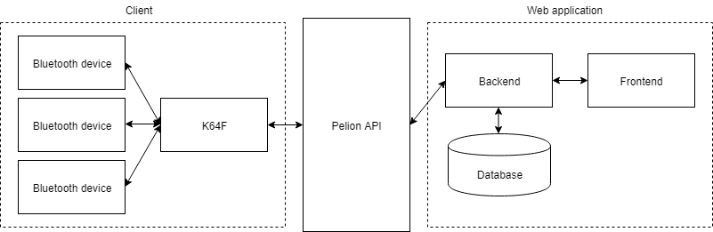

# Pelion-E2E-WebApp

This is a higher level repository for the 2018 University of Oulu software project course WebApp client. Our project is split in to two parts, web app and client. Client repository can be found in: https://github.com/tomlehto/Pelion-E2E-Client

Web app is divided in to frontend and backend. Backend provides functionality, which frtonend utilizes to manipulate and view data. Further instructions to install and use can be found in backend and frontend directories.
